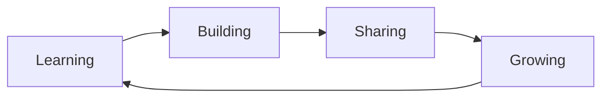

<div align="center">
  
</div>

<div align="center">
  
</div>

<p align="center">
  
  <a href="https://github.com/Sonukumar12jan"></a>
  
</p>

<p align="center">
  <a href="https://linkedin.com/in/sonukumar12jan" target="_blank">
    
  </a>
  <a href="https://github.com/Sonukumar12jan" target="_blank">
    
  </a>
  <a href="https://twitter.com/sonukumar12jan" target="_blank">
    
  </a>
</p>


##  About Me

```javascript
const sonuKumar = {
    location: "India 🇮🇳",
    role: "Full-Stack Developer & Software Engineer",
    passion: ["Coding", "Problem Solving", "Learning New Tech"],
    currentlyLearning: "Advanced Web Development & DSA 📚",
    funFact: "I turn coffee into code! ☕️",
    askMeAbout: ["Web Dev", "JavaScript", "React", "Node.js"],
    technologies: {
        frontend: ["React", "JavaScript", "HTML5", "CSS3", "Tailwind"],
        backend: ["Node.js", "Express", "MongoDB"],
        languages: ["JavaScript", "TypeScript", "Java", "Python"],
        databases: ["MongoDB", "MySQL", "PostgreSQL"],
        tools: ["Git", "GitHub", "VS Code", "Postman"],
        cloud: ["AWS", "Heroku", "Netlify", "Vercel"]
    },
    architecture: ["Single Page Applications", "RESTful APIs", "Microservices"],
    currentFocus: "Building scalable web applications 🎯",
    goals2024: "Master System Design & Contribute to Open Source",
    motto: "Keep Learning, Keep Growing 🌱"
};
```


##  Tech Stack & Skills

<details open>
<summary><b>🎨 Frontend Development</b></summary>
<br>
<p align="center">
  
</p>
<p align="center">
  
  
  
  
</p>
</details>

<details open>
<summary><b>⚙️ Backend Development</b></summary>
<br>
<p align="center">
  
</p>
<p align="center">
  
  
  
  
</p>
</details>

<details open>
<summary><b>💻 Programming Languages</b></summary>
<br>
<p align="center">
  
</p>
<p align="center">
  
  
  
  
</p>
</details>

<details open>
<summary><b>🛠️ Tools & Technologies</b></summary>
<br>
<p align="center">
  
</p>
<p align="center">
  
  
  
  
</p>
</details>


## 📊 GitHub Analytics & Statistics

<div align="center">
  
</div>

<br/>

<div align="center">
  
  
</div>

<div align="center">
  
  
</div>

<br/>

<div align="center">
  
</div>

<br/>

<div align="center">
  
</div>


## 🐍 Contribution Snake

<div align="center">
  
</div>


## 🔥 Recent Activity

<!--START_SECTION:activity-->
<!--END_SECTION:activity-->


## 🚀 Featured Projects

<div align="center">
  <a href="https://github.com/Sonukumar12jan?tab=repositories">
    
  </a>
  <a href="https://github.com/Sonukumar12jan?tab=repositories">
    
  </a>
</div>


## 💡 Quote of the Day

<div align="center">
  
</div>


## 📫 Let's Connect & Collaborate!

<div align="center">
  <a href="https://linkedin.com/in/sonukumar12jan">
    
  </a>
  <a href="https://github.com/Sonukumar12jan">
    
  </a>
  <a href="mailto:sonukumar@example.com">
    
  </a>
  <a href="https://twitter.com/sonukumar12jan">
    
  </a>
</div>

<br/>

<div align="center">
  
</div>


## 🎯 Current Focus



<div align="center">

### 📚 Currently Exploring
- Advanced React Patterns & Performance Optimization
- System Design & Scalable Architecture
- Cloud Technologies (AWS, Docker, Kubernetes)
- Data Structures & Algorithms (DSA)
- Open Source Contributions

</div>


## 📈 Contribution Graph

<div align="center">
  
</div>


<div align="center">
  
</div>

<div align="center">
  
</div>

---

<p align="center">
  
  
  
</p>

<div align="center">
  
### Show some ❤️ by starring some of the repositories!

</div>

---

<p align="center">
  
  <br>
  <b>⭐️ From <a href="https://github.com/Sonukumar12jan">Sonukumar12jan</a> with 💖</b>
</p>
